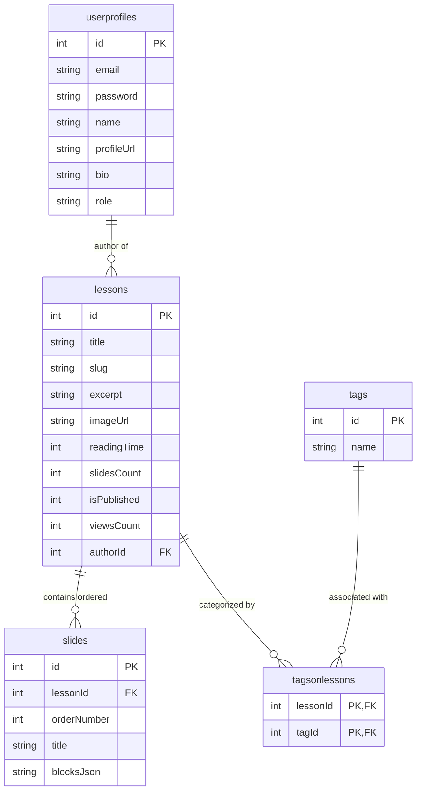

# ✍️ Kadha 2.0 – Edge-Powered Modern Interactive Notes Platform

**Kadha 2.0** is an edge-native, serverless educational note-sharing and slide-based learning platform. Built with **React 19**, **Vite**, **Tailwind CSS**, **Framer Motion**, **Hono**, and powered by Cloudflare's serverless edge database service **Cloudflare D1 (SQLite)**.

---

## ✨ Features & Capabilities

* ⚡ **Edge-Native Cloudflare D1 Database**: Built on Cloudflare Workers + Hono API with edge-backed SQLite storage (`c.env.DB`).
* 🎨 **Modern Glassmorphic UI**: Vibrant dark mode aesthetics, glassmorphism, Framer Motion micro-animations, and responsive layouts.
* 📖 **Slide-Based Reader Experience**:
  * Progressive 5-slide batch prefetching with `sessionStorage` caching.
  * Interactive slide canvas with keyboard navigation (`←` / `→` / `Home` / `End`).
  * Live Mermaid diagram rendering and Syntax Highlighted code blocks.
  * One-click PDF Export dialog & Web Share API integration (mobile native share + desktop clipboard fallback).
* 🔖 **Local Favorites & Bookmarks**: Save notes locally using `useBookmarks` with instant filter pills on the home feed.
* ✍️ **Visual Slide-Based Markdown Editor**:
  * Interactive concept slide authoring with drag/order controls.
  * Rich content blocks (Paragraphs, Code, Callouts, Mermaid Diagrams, Quizzes, Images).
  * Short description / excerpt editor with live character counter (300 max).
  * Auto-saving local draft recovery (syncs every 4 seconds).
* 🏷️ **Instant Search & Topic Management**:
  * Live debounced search across note titles and content.
  * Tag filtering pills driven dynamically by the database.
  * Dedicated Tag Manager screen for subject tag lifecycle management.
* 👤 **Author Studio & Profile Management**: Author profile settings, initial password reset, multi-author provisioning, and published/draft note toggling.

---

## 📂 Complete Architecture & Directory Structure

```
kadha2.0/
├── backend/                              # Cloudflare Worker API (Hono Framework + D1 Database)
│   ├── schema.sql                        # SQLite D1 Schema (lessons, slides, userprofiles, tags, media)
│   ├── seed.sql                          # Demo database seed data & sample lessons
│   ├── wrangler.jsonc                    # Cloudflare Wrangler worker configuration & D1 binding
│   └── src/
│       ├── index.js                      # Hono API entry point, CORS configuration & rate limiting
│       └── routes/
│           ├── lessons.js                # Core REST API for lessons, slides, tags & search stats
│           ├── user.js                   # Authentication (/signin), profile management & password reset
│           ├── media.js                  # Image upload & media library management
│           ├── middleware.js             # JWT authentication middleware & password hashing
│           └── rateLimiter.js            # In-memory IP rate limiter middleware
│
└── frontend/                             # Single Page Application (React 19 + Vite + Tailwind CSS)
    ├── index.html                        # Main HTML template & Google Font imports
    ├── vite.config.js                    # Vite bundler configuration & dev server setup
    ├── src/
    │   ├── main.jsx                      # React application root entry point
    │   ├── App.jsx                       # React Router definitions & lazy-loaded routes
    │   ├── index.css                     # Design tokens, CSS variables, glassmorphic styles & animations
    │   ├── assets/                       # SVG icons, logos, and static image assets
    │   ├── components/                   # Application UI components
    │   │   ├── SEO.jsx                   # Dynamic head meta tags & OpenGraph SEO manager
    │   │   ├── ThemeProvider.jsx         # next-themes Dark/Light theme provider wrapper
    │   │   ├── Toaster.jsx               # Toast notification provider & custom hook
    │   │   ├── MediaLibraryModal.jsx     # Media upload modal for inserting images into notes
    │   │   ├── blocks/                   # Visual Editor & Reader Content Block components
    │   │   │   ├── CalloutBlock.jsx      # Tip, Warning, and Info callout boxes
    │   │   │   ├── CodeBlock.jsx         # Code snippet block with copy button
    │   │   │   ├── DiagramBlock.jsx      # Dynamic Mermaid diagram previewer
    │   │   │   └── QuizBlock.jsx         # Interactive multiple-choice quiz block
    │   │   ├── editor/                   # Visual Editor components
    │   │   │   └── VisualSlideEditor.jsx # Split-screen slide authoring & block drag-and-drop
    │   │   ├── reader/                   # Slide Reader components
    │   │   │   ├── ImageZoomModal.jsx    # Fullscreen image light-box modal
    │   │   │   ├── TrackBottomDock.jsx   # Floating slide navigation dock & progress bar
    │   │   │   ├── TrackCanvas.jsx       # Main slide viewer canvas with Framer Motion slide transitions
    │   │   │   └── TrackHeader.jsx       # Floating top header with menu, outline drawer, share & PDF export
    │   │   └── ui/                       # Reusable UI component library
    │   │       ├── Appbar.jsx            # Sticky glassmorphic top navigation bar
    │   │       ├── Badge.jsx             # Tag & status badge pill component
    │   │       ├── BlogCard.jsx          # Interactive note preview card with bookmark toggle
    │   │       ├── Button.jsx            # Styled button with neon/outline/ghost variants
    │   │       ├── Card.jsx              # Glassmorphic card container primitives
    │   │       ├── Footer.jsx            # Platform footer with navigation links
    │   │       ├── Hero.jsx              # Landing page hero header with live database stats
    │   │       ├── HomeBlogs.jsx         # Homepage notes feed with sort, search, topic pills & bookmarks
    │   │       ├── Input.jsx             # Form input field with focus ring styling
    │   │       ├── Label.jsx             # Form field label component
    │   │       ├── Pagination.jsx        # Paginated page switcher control
    │   │       ├── SearchBar.jsx         # Live search modal input dropdown
    │   │       └── Skeleton.jsx          # Loading skeleton animation placeholder
    │   ├── hooks/                        # Custom React hooks
    │   │   ├── useBlogs.js               # Hook for fetching paginated lessons with filters
    │   │   ├── useBookmarks.js           # LocalStorage persistent bookmarking hook
    │   │   ├── useSearch.js              # Debounced edge search query hook
    │   │   └── useTags.js                # Database topic tags fetching hook
    │   ├── lib/                          # Utility helpers
    │   │   └── utils.js                  # Tailwind class merger (clsx + tailwind-merge)
    │   └── utils/                        # Core application utilities
    │       ├── api.js                    # Centralized Axios instance with JWT interceptor
    │       ├── getenv.js                 # Environment variable reader (VITE_APIURL)
    │       └── markdown.js               # Markdown parser, Mermaid wrapper & slide split helper
```

---

## 🗄️ Database Schema Architecture (Cloudflare D1 SQLite)



---

## 🛠️ REST API Endpoints Overview

| Method | Endpoint | Description | Auth Required |
| :--- | :--- | :--- | :---: |
| `GET` | `/lessons/getall` | Fetch paginated lessons with tag, search query & sort options | ❌ |
| `GET` | `/lessons/get/:id` | Fetch single lesson with ordered slides (supports `offset` & `limit`) | ❌ |
| `GET` | `/lessons/stats` | Retrieve platform-wide total lessons, views & tags count | ❌ |
| `GET` | `/lessons/tags` | Fetch all active subject tags | ❌ |
| `POST` | `/lessons/add` | Create a new lesson note with ordered slides | ✅ |
| `PUT` | `/lessons/edit/:id` | Update an existing lesson, slides & attached tags | ✅ |
| `DELETE` | `/lessons/delete/:id` | Delete a lesson note and cascading slides | ✅ |
| `POST` | `/lessons/tags/create` | Add new subject tags | ✅ |
| `DELETE` | `/lessons/tags/:id` | Delete a tag and remove associated lesson mappings | ✅ |
| `POST` | `/user/signin` | Authenticate author and receive JWT token | ❌ |
| `GET` | `/user/profile` | Retrieve current authenticated author profile & stats | ✅ |
| `PUT` | `/user/profile` | Update author bio, name, avatar & social links | ✅ |
| `POST` | `/user/reset-password` | Update current author password | ✅ |
| `POST` | `/user/add-author` | Provision a new author / admin account | ✅ |

---

## 🚀 Getting Started Locally

### 1. Initialize Backend & Cloudflare D1 Local SQLite Database

Inside `backend/`:

```bash
cd backend
npm install

# Initialize schema and seed demo content into local D1 SQLite
npm run db:init
npm run db:seed

# Start the Cloudflare Worker API server (runs at http://localhost:8787)
npm run dev
```

### 2. Start the Frontend React Application

Inside `frontend/`:

```bash
cd frontend
npm install

# Start Vite dev server (runs at http://localhost:3000)
npm run dev
```

---

## ☁️ Deploying to Production (Cloudflare Pages & D1)

1. Create a remote D1 database on Cloudflare:
   ```bash
   wrangler d1 create kadha2-db
   ```
2. Initialize database schema & seed remote database:
   ```bash
   npm run db:remote-init
   npm run db:remote-seed
   ```
3. Deploy Worker API backend:
   ```bash
   npm run deploy
   ```
4. Build and deploy frontend bundle:
   ```bash
   cd frontend
   npm run build
   ```
