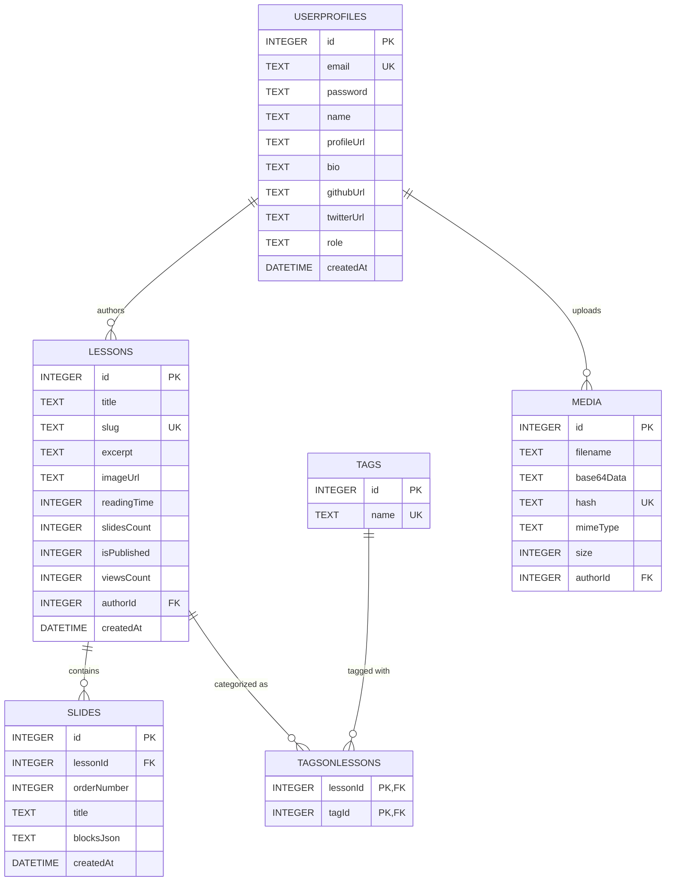

# ✍️ Notes – Edge-Powered Interactive Visual Notes Platform

[](https://phaneendramarri.github.io/notes/)
[](https://workers.cloudflare.com/)
[](https://developers.cloudflare.com/d1/)
[](https://react.dev/)
[](https://tailwindcss.com/)

**Notes** is a modern, edge-native interactive knowledge-base and slide-by-slide learning platform designed for software engineering concepts, deep dives, architectural blueprints, algorithms, and study tracks.

Built from the ground up on a serverless edge stack powered by **React 19**, **Vite**, **Tailwind CSS**, **Framer Motion**, **Hono**, and **Cloudflare D1 (Serverless SQLite)**.

---

## 🌐 Live Application

* **Web App**: [https://phaneendramarri.github.io/notes/](https://phaneendramarri.github.io/notes/)
* **GitHub Repository**: [https://github.com/phaneendramarri/notes](https://github.com/phaneendramarri/notes)

---

## ✨ What We Are Doing & Key Features

### 1. 📖 Immersive Slide-Based Reader
* **Slide Canvas & Transitions**: Slide-by-slide learning with smooth Framer Motion direction-aware transitions.
* **Dual Reading Progress Indicators**:
  * **In-Navbar Counter**: Displays slide index (`Slide X of Y`), miniature progress bar, and estimated time remaining.
  * **Below-Navbar Ambient Accent**: Minimalist bottom-edge progress indicator attached to the header.
* **Table of Contents Outline**: Sliding index drawer to jump directly to any slide chapter with visited status indicators.
* **Rich Content Rendering**: Native support for:
  * 📊 **Mermaid.js Diagrams**: Interactive architecture, sequence, class, state, and flow diagrams.
  * 🧮 **KaTeX Mathematical Equations**: LaTeX mathematical expression formatting.
  * 💻 **Syntax Highlighted Code**: Multi-language code snippets with one-click copy.
  * 💡 **Callout Boxes**: Structured Tips, Warnings, Insights, and Notes.
  * ❓ **Interactive Quizzes**: Multiple-choice self-assessment checks.
* **Reader Navigation & Shortcuts**:
  * Keyboard navigation (`←` / `→` / `Space`, `F` fullscreen, `?` shortcuts guide).
  * One-click PDF / Print Export styling.
  * Web Share API integration (native mobile share sheet with clipboard fallback).

### 2. ✍️ Full-Featured Author Studio & Editor
* **Block-Based WYSIWYG Slide Authoring**: Create, edit, reorder, and delete slides with real-time preview.
* **Media Library Integration**: Embedded base64 image uploader with deduplication hashing (`media` table).
* **Tag Association**: Attach topics and subject tags directly to notes.
* **Draft & Published States**: Toggle note visibility with live status badges.
* **Auto-Saving Draft Engine**: Local draft sync protecting against accidental data loss.

### 3. 🏷️ Discovery & Instant Search
* **Global Search Modal (`Ctrl+K` / `Cmd+K`)**: Live debounced search across note titles, descriptions, and content.
* **Topic Pill Filtering**: Database-driven category badges for instant filtering (C#, .NET Core, DSA, SQL, System Design).
* **Dedicated Tag Manager**: Manage, add, and clean up topic tags.

### 4. ⚡ Edge-Native Architecture & Auth
* **Zero Cold-Start Backend**: Powered by Cloudflare Workers and Hono routing framework.
* **Serverless SQLite (Cloudflare D1)**: Low-latency edge database queries across global points of presence.
* **Author Portal & Security**:
  * JWT-authenticated session tokens.
  * Secure PBKDF2 password hashing.
  * In-portal password update (`PUT /api/auth/password`).
  * Admin-level multi-author provisioning (`POST /api/auth/authors`).
  * Rate-limiting middleware with edge IP tracking.

---

## 📂 Project Architecture & Directory Structure

```
Notes/
├── backend/                              # Cloudflare Worker API (Hono + Cloudflare D1)
│   ├── schema.sql                        # SQLite D1 Schema (lessons, slides, userprofiles, tags, media)
│   ├── seed.sql                          # Initial seed data & engineering lesson tracks
│   ├── wrangler.jsonc                    # Cloudflare Worker configuration & D1 database bindings
│   ├── package.json                      # Backend dependencies & scripts
│   └── src/
│       ├── index.js                      # Hono API entry point, CORS & global error handling
│       ├── db/
│       │   └── queries.js                # Prepared SQL queries for D1 database operations
│       ├── middleware/
│       │   └── auth.js                   # JWT verification & password hashing utilities
│       └── routes/
│           ├── auth.js                   # Auth endpoints (/signin, /profile, /password, /authors)
│           ├── lessons.js                # Notes & slide endpoints (/lessons, /slides, /stats)
│           ├── media.js                  # Image uploads & media library management
│           └── tags.js                   # Topic tags management endpoints
│
└── frontend/                             # Single Page Application (React 19 + Vite + Tailwind CSS)
    ├── index.html                        # Root HTML template, favicon & SEO meta tags
    ├── vite.config.js                    # Vite bundler config with base path & code splitting
    ├── package.json                      # Frontend dependencies & deployment scripts
    ├── assets/
    │   └── phaneendramarri.svg           # Primary brand vector asset (logo & favicon)
    ├── public/
    │   ├── robots.txt                    # Search crawler directives
    │   └── sitemap.xml                   # Dynamic search engine sitemap
    └── src/
        ├── main.jsx                      # React application bootstrap
        ├── App.jsx                       # Route registry (public feeds, reader, protected studio)
        ├── index.css                     # Custom design tokens, glassmorphism, & theme utilities
        ├── api/
        │   └── client.js                 # Centralized Axios instance with auth interceptor
        ├── hooks/
        │   ├── useBlogs.js               # Paginated notes query hook
        │   ├── useBookmarks.js           # Local bookmarking hook
        │   ├── useSearch.js              # Live debounced search hook
        │   └── useTags.js                # Topic tag fetching hook
        ├── pages/
        │   ├── HomePage.jsx              # Discovery feed, hero section, topic pills & note catalog
        │   ├── LessonReaderPage.jsx      # Slide-by-slide reading canvas experience
        │   ├── LessonEditorPage.jsx      # Block-based visual slide authoring studio
        │   ├── StudioPage.jsx            # Author dashboard & lesson management
        │   ├── TagManagerPage.jsx        # Topic tag management screen
        │   ├── ProfilePage.jsx           # Author profile & password security management
        │   ├── SigninPage.jsx            # Secure author login portal
        │   └── NotFoundPage.jsx          # 404 fallback page
        ├── components/
        │   ├── SEO.jsx                   # Dynamic head tags & OpenGraph metadata
        │   ├── blocks/                   # Slide content block renderers (Code, Diagram, Quiz, Callout)
        │   ├── editor/                   # Visual slide authoring & block controls
        │   ├── layout/                   # Global Navbar, Footer, and Page Shells
        │   ├── reader/                   # SlideCanvas, ReaderNavbar, ReaderDock, & Modals
        │   └── ui/                       # Buttons, Cards, Skeletons, Toasts, Search Modal, Catalog
        └── utils/
            ├── api.js                    # API utilities
            ├── getenv.js                 # Environment variable resolver
            └── markdown.js               # Markdown & diagram parser
```

---

## 🗄️ Database Schema Architecture (Cloudflare D1 SQLite)



---

## 🛠️ REST API Specification

All backend endpoints are prefixed with `/api` and served from the Cloudflare Worker:

### Authentication & Profile (`/api/auth`)
| Method | Route | Description | Auth Required |
| :--- | :--- | :--- | :---: |
| `POST` | `/api/auth/signin` | Authenticate author and receive JWT token | ❌ |
| `GET` | `/api/auth/profile` | Retrieve profile and author view statistics | ✅ |
| `PUT` | `/api/auth/profile` | Update profile information and social links | ✅ |
| `PUT` / `POST` | `/api/auth/password` | Update current author password | ✅ |
| `POST` | `/api/auth/authors` | Provision a new author account (Admin only) | ✅ |

### Notes & Lessons (`/api/lessons`)
| Method | Route | Description | Auth Required |
| :--- | :--- | :--- | :---: |
| `GET` | `/api/lessons` | Fetch paginated lessons with search, tag filter & sorting | ❌ |
| `GET` | `/api/lessons/:id` | Fetch lesson details and initial slide batch | ❌ |
| `GET` | `/api/lessons/:id/slides` | Fetch paginated slides (`offset` & `limit`) | ❌ |
| `GET` | `/api/lessons/stats/summary` | Fetch total platform lessons, views, and tag metrics | ❌ |
| `POST` | `/api/lessons` | Create a new lesson note with ordered slides | ✅ |
| `PUT` | `/api/lessons/:id` | Update note details, slides, and tag associations | ✅ |
| `DELETE` | `/api/lessons/:id` | Delete a note and cascade delete its slides | ✅ |

### Topic Tags (`/api/tags`)
| Method | Route | Description | Auth Required |
| :--- | :--- | :--- | :---: |
| `GET` | `/api/tags` | List all active topic tags with note counts | ❌ |
| `POST` | `/api/tags` | Create a new topic tag | ✅ |
| `DELETE` | `/api/tags/:id` | Remove a topic tag | ✅ |

### Media Library (`/api/media`)
| Method | Route | Description | Auth Required |
| :--- | :--- | :--- | :---: |
| `GET` | `/api/media` | Retrieve uploaded media library items | ✅ |
| `POST` | `/api/media/upload` | Upload and hash media base64 images | ✅ |
| `DELETE` | `/api/media/:id` | Remove a media asset | ✅ |

---

## 🚀 Local Development Setup

### 1. Prerequisites
* [Node.js](https://nodejs.org/) (v18 or later)
* [Cloudflare Wrangler CLI](https://developers.cloudflare.com/workers/wrangler/install-and-update/) (`npm install -g wrangler`)

### 2. Run Backend Locally
```bash
cd backend
npm install

# Initialize local SQLite D1 schema and seed demo data
npm run db:init
npm run db:seed

# Start the Cloudflare Worker API on http://localhost:8787
npm run dev
```

### 3. Run Frontend Locally
```bash
cd frontend
npm install

# Start Vite development server on http://localhost:3000
npm run dev
```

---

## ☁️ Deployment

### Deploy Backend Worker
```bash
cd backend
npm run deploy
```

### Deploy Frontend to GitHub Pages
```bash
cd frontend
npm run deploy
```

---

## 👨‍💻 Author & Connect

**Created & Curated with ❤️ by Phaneendra Marri**

* 🌐 **Personal Website**: [https://phaneendramarri.com](https://phaneendramarri.com)
* 📖 **Notes Platform**: [https://phaneendramarri.github.io/notes/](https://phaneendramarri.github.io/notes/)
* 🐙 **GitHub**: [@phaneendramarri](https://github.com/phaneendramarri)
* 💼 **LinkedIn**: [Phaneendra Marri](https://linkedin.com/in/phaneendramarri)
* 🐦 **Twitter / X**: [@phaneendramarri](https://x.com/phaneendramarri)
* 📺 **YouTube**: [@phaneendramarri](https://youtube.com/@phaneendramarri)

---

## 📄 License

This project is open-source and available under the [MIT License](LICENSE).
